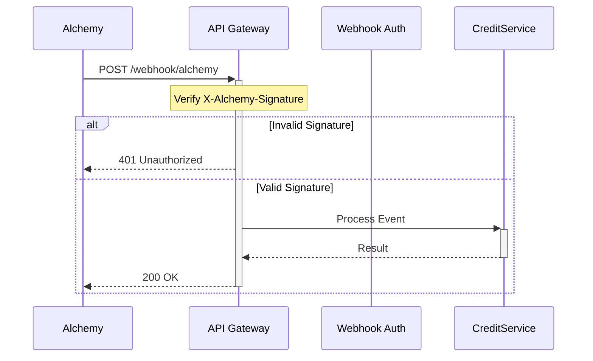

# Alchemy Service

This service handles interactions with Alchemy's blockchain infrastructure, including webhook processing for real-time event notifications.

## Webhook Security

The Alchemy webhook endpoint (`/api/webhook/alchemy`) is secured using Alchemy's signature verification system. Each webhook request from Alchemy includes a signature that we verify to ensure the request is legitimate.

### Setup Requirements

1. Set the `ALCHEMY_SIGNING_KEY` environment variable with your webhook signing key from Alchemy:
   ```bash
   export ALCHEMY_SIGNING_KEY=whsec_your_key_here
   ```

2. In your Alchemy dashboard, configure the webhook URL to point to your `/api/webhook/alchemy` endpoint.

### Security Measures

1. **Signature Verification**: Each request must include a valid `X-Alchemy-Signature` header that matches a HMAC SHA-256 hash of the raw request body using your signing key.

2. **Timing Attack Prevention**: The signature comparison is done using a constant-time algorithm to prevent timing attacks.

3. **Required Headers**: Requests without the required signature header are rejected with a 401 status code.

### Testing

To test webhook authentication:

1. Valid request with correct signature:
   ```bash
   curl -X POST https://your-api/api/webhook/alchemy \
     -H "X-Alchemy-Signature: computed_signature" \
     -H "Content-Type: application/json" \
     -d '{"type":"GRAPHQL","event":{"data":{"block":{"logs":[]}}}}'
   ```

2. Invalid request (should be rejected):
   ```bash
   curl -X POST https://your-api/api/webhook/alchemy \
     -H "X-Alchemy-Signature: invalid_signature" \
     -H "Content-Type: application/json" \
     -d '{"type":"GRAPHQL"}'
   ```

### Error Responses

- Missing signature: 401 Unauthorized
- Invalid signature: 401 Unauthorized
- Missing request body: 400 Bad Request
- Internal errors: 200 OK (to prevent Alchemy from disabling the webhook)

## Sequence Diagram



## Implementation Details

The webhook security is implemented in two main components:

1. `webhookUtils.js` - Contains the signature verification middleware
2. `routes/index.js` - Applies the middleware to the webhook endpoint

See the respective files for detailed implementation. 