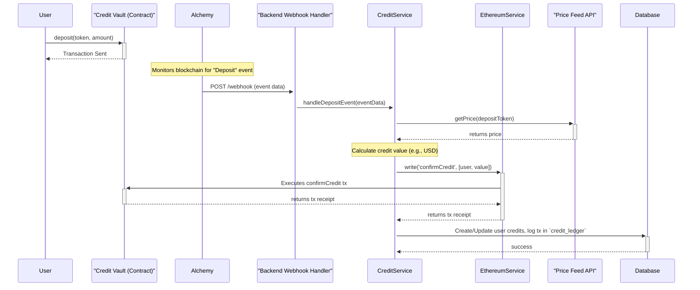
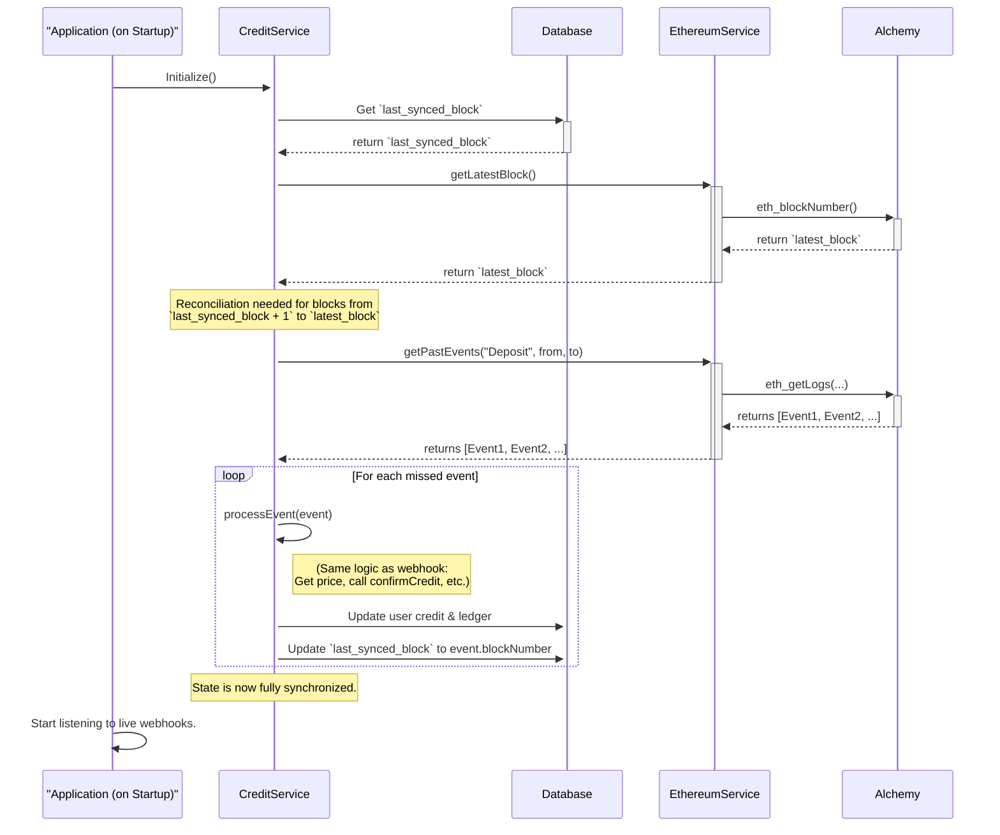

# README: Alchemy On-Chain State Service (`src/core/services/db/alchemy`)

## Overview

This directory contains the database access layer responsible for persisting the state of on-chain interactions related to the application's smart contracts, primarily the `CreditVault`. This service is a critical component for synchronizing the application's internal state with the state of the Ethereum blockchain.

It provides the foundational database operations required by the `CreditService` to manage user credits based on blockchain events.

## Core Responsibilities

1.  **Ledgering On-Chain Events**: Tracks all relevant smart contract events (e.g., `Deposit`, `Withdrawal`) in a `credit_ledger` collection. This provides a complete, auditable history of all value-transacting events, forming the basis for our accounting.
2.  **State Synchronization**: Manages a `last_synced_block` value in a `system_state` collection. This is crucial for the **Startup Reconciliation Process**, allowing the system to query and process any events it may have missed during downtime.

---

## System Flows

### 1. Live Deposit Webhook Flow

This is the primary flow for handling new deposits in real-time.

### 2. Startup Reconciliation Flow

This flow runs every time the application starts to ensure no events were missed while it was offline.

---

## Database Schema

### `credit_ledger` Collection

This collection acts as the financial ledger for all on-chain credit-related activities. It is designed to handle deposits from both the main `CreditVault` and individual `VaultAccount` referral contracts.

| Column                     | Type      | Description                                                                              |
| -------------------------- | --------- | ---------------------------------------------------------------------------------------- |
| `_id`                      | ObjectId  | Primary Key                                                                              |
| `deposit_tx_hash`          | String    | The unique hash of the user's on-chain deposit transaction. (Indexed)                    |
| `deposit_log_index`        | Integer   | The log index of the event (needed to uniquely identify an event).                       |
| `deposit_block_number`     | Number    | The block number of the deposit. **(Critical for reconciliation)**                       |
| `deposit_contract_address` | String    | The address of the contract that received the deposit (main or referral). (Indexed)      |
| `deposit_contract_type`    | String    | `'MAIN_VAULT'` or `'REFERRAL_VAULT'`. (Indexed)                                            |
| `deposit_event_name`       | String    | The name of the emitted event (e.g., 'Deposit', 'AccountDeposit').                      |
| `masterAccountId`          | ObjectId  | Foreign key to our `userCore` collection. (Indexed)                                      |
| `depositor_address`        | String    | The wallet address that made the deposit.                                                |
| `referrer_address`         | String    | The wallet address of the referrer, if applicable. Null otherwise. (Indexed)             |
| `deposit_amount_wei`       | String    | The raw amount of the token deposited.                                                   |
| `deposit_value_usd`        | Number    | The calculated USD value of the deposit at that time.                                    |
| `status`                   | String    | `PENDING_CONFIRMATION`, `CONFIRMED`, `FAILED`, `ERROR`. (Indexed)                          |
| `confirmation_tx_hash`     | String    | The hash of *our bot's* transaction that confirms the credit.                            |
| `createdAt`                | Timestamp |                                                                                          |
| `updatedAt`                | Timestamp |                                                                                          |

### `system_state` Collection

A simple key-value store for system-wide metadata.

| Column | Type   | Description                                           |
| ------ | ------ | ----------------------------------------------------- |
| `_id`  | String | The name of the state variable (e.g., `last_synced_block`). |
| `value`  | Any    | The value of the state variable.                      |

This design provides a robust, auditable, and resilient foundation for integrating our application with the Ethereum blockchain. 