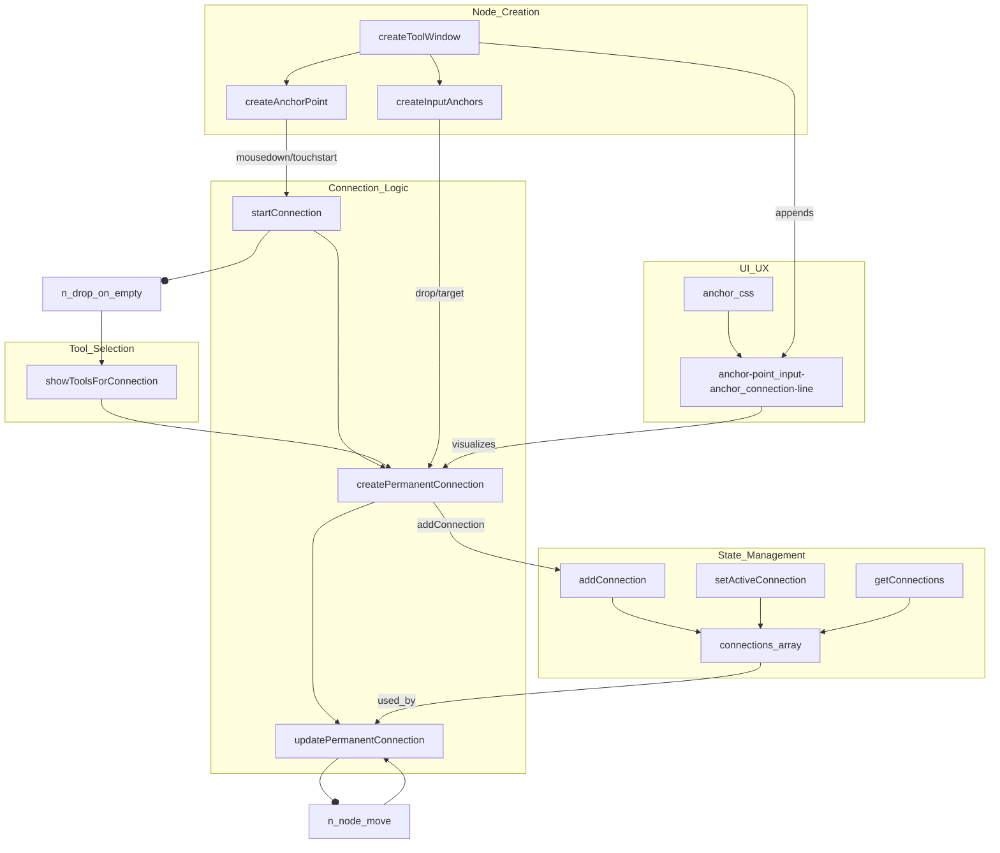

## Kickoff Prompt

> You are entering the Node Connection (Persistent) project for the StationThis Sandbox Node Editor.
> 
> - **Purpose:** Enable persistent, visual connections between node outputs and inputs in the sandbox editor.
> - **Start by:** Reviewing the codebase audit section below, reading the [Master Plan](./SANDBOX_NODE_EDITOR_MASTER_PLAN.md), and checking the latest handoff.
> - **Protocol:** Follow the [AGENT_COLLABORATION_PROTOCOL.md](../../AGENT_COLLABORATION_PROTOCOL.md) for all work, including documentation and demonstration requirements.
> 
> Please begin by auditing the current codebase for all relevant files, functions, and architectural constraints related to this feature.

# Node Connection Feature

## Purpose
Enable persistent, visual connections between node outputs and inputs in the sandbox editor.

## Step 1: Codebase Audit

- [ ] List all files and functions related to node creation, anchor points, and connection logic.
- [ ] Document current state of connection UI and state management.
- [ ] Identify any blockers or architectural constraints.

## Step 1a: Function Map & Audit Notes

### Function Map (Current Node Connection System)



### Audit Notes

**Relevant Files & Functions:**
- `src/platforms/web/client/src/sandbox/node.js`: Node creation, anchor points, input anchors.
- `src/platforms/web/client/src/sandbox/connections.js`: Connection drag logic, permanent connection creation, updating connection lines.
- `src/platforms/web/client/src/sandbox/state.js`: State for connections, tool windows, and connection management.
- `src/platforms/web/client/src/sandbox/canvas.js`: Utility for drawing/updating connection lines.
- `src/platforms/web/client/src/sandbox/style/components/anchor.css`: Styles for anchors and connection lines.
- `src/platforms/web/client/src/sandbox/toolSelection.js`: Modal for tool selection when connecting to empty space.

**Current State:**
- Connections are visualized as absolutely positioned divs styled as lines.
- State is managed in-memory (not persisted).
- No cycle prevention or connection validation.
- No logic for removing connections when a node is deleted.
- Connections are tracked as DOM references, not serializable data.

**Blockers/Constraints:**
- Need to design a serializable/persistent data structure for connections.
- Need to handle node deletion and connection cleanup.
- Need to add cycle prevention and error handling for invalid connections.

## Behavior & Requirements Clarification

**Current Behavior:**
- Dragging from an anchor point on a tool window shows a line following the mouse.
- On release, a tool selection menu appears; selecting a tool creates a new node at that spot.
- There is currently no persistent connection (visual or in state), and the new node does not actually use the output of the previous node as its input.

**Requirements for Improved Node Connections:**
1. **Data Flow:**
   - The output of the source node should be automatically wired as the input to the new node when created via drag-connect.
   - For images, this should populate fields like `input_image`, `input_control_image`, `input_style_image`, etc., with the ability to adjust after creation.
2. **Multiple Inputs/Outputs:**
   - Nodes can have multiple outputs and multiple inputs.
   - Outputs can connect to multiple inputs and vice versa.
3. **Connection Editing:**
   - Users should be able to reroute, disconnect, or delete connections after creation.
   - Connections should be draggable, not just created via anchor drag.
4. **Persistence & Undo/Redo:**
   - Connections must persist across page reloads (localStorage or backend).
   - Undo/redo functionality for connections is required.
5. **Validation & Constraints:**
   - Cycles must be prevented (e.g., A → B → A is not allowed; user must create a new A node).
   - Type compatibility between outputs and inputs is required; only valid connections are allowed.
6. **Node Deletion:**
   - Deleting a node should automatically remove all related connections.
7. **UI/UX:**
   - Visual feedback for valid/invalid connection targets while dragging.
   - If a connection is invalid, prevent it and inform the user why.
   - Tool selection menu should filter and show only compatible tools based on the output type of the source node.

---

## Step 2: Design

- [ ] Define data structures for connections.
- [ ] UI/UX sketches for connection creation, deletion, and visualization.
- [ ] Error handling (cycles, invalid connections).

## Step 2a: Design Details

### 1. Data Structures for Connections
- **Connection Object Example:**
  ```js
  {
    id: 'connection-uuid',
    from: { nodeId: 'nodeA', output: 'output_image' },
    to: { nodeId: 'nodeB', input: 'input_image' },
    type: 'image', // or 'text', 'audio', etc.
    createdAt: 1234567890
  }
  ```
- **Connections State:**
  - Array of connection objects, serializable for persistence.
  - Each node has a unique `nodeId`.
  - Inputs/outputs are referenced by name for flexibility (multiple per node).

### 2. Persistence Strategy
- **LocalStorage (MVP):**
  - Serialize the array of connections and node positions to localStorage on change.
  - On page load, restore nodes and connections from localStorage.
- **Backend Sync (Future):**
  - Optionally sync to backend for multi-user or cloud persistence.
- **Undo/Redo:**
  - Maintain a history stack of connection and node state changes for undo/redo.

### 3. UI/UX for Connections
- **Creation:**
  - Drag from an output anchor to an input anchor or empty space.
  - If dropped on a compatible input, create a persistent connection (visual line and state).
  - If dropped on empty space, show filtered tool menu; new node is auto-wired as input.
- **Editing:**
  - Click or right-click a connection line to show options: delete, reroute, inspect.
  - Drag connection ends to reroute to a different node/input/output.
- **Deletion:**
  - Deleting a node removes all its connections.
- **Visualization:**
  - Persistent lines between anchors, styled for clarity.
  - Visual feedback (color, glow, tooltip) for valid/invalid targets during drag.

### 4. Error Handling & Validation
- **Cycle Prevention:**
  - Before creating a connection, check for cycles in the graph; block and inform user if detected.
- **Type Compatibility:**
  - Only allow connections between compatible output/input types; show error if not compatible.
- **Invalid Actions:**
  - Prevent connecting a node to itself.
  - Show clear error messages for invalid connection attempts.

---

## Step 2b: Implementation Planning

### 1. Mapping Current Code to New Data Structures
- **Current State:**
  - Connections are not persisted; only visual lines are drawn temporarily.
  - No serializable connection objects; DOM references are used.
- **Plan:**
  - Refactor connection creation logic to generate and store connection objects (with node IDs, input/output names, type).
  - Assign unique IDs to all nodes/tool windows if not already present.
  - Update connection logic to reference nodes by ID, not DOM element.

### 2. Migration Strategy for State
- **Step 1:**
  - Introduce a new `connections` array in state, using the designed data structure.
  - On every connection creation/deletion, update this array and persist to localStorage.
- **Step 2:**
  - On page load, restore nodes and connections from localStorage, reconstructing the UI.
  - For backward compatibility, detect and upgrade any legacy state (if needed).

### 3. Incremental UI/UX Upgrades
- **Phase 1:**
  - Make connection lines persistent and tied to state.
  - Show persistent lines between nodes after reload.
- **Phase 2:**
  - Enable connection editing (delete, reroute) via UI.
  - Add visual feedback for valid/invalid targets during drag.
- **Phase 3:**
  - Implement undo/redo for connections.
  - Add cycle prevention and type compatibility validation.

### 4. Testing and Validation Plan
- **Unit Tests:**
  - Test connection creation, deletion, rerouting, and persistence logic.
  - Test cycle detection and type compatibility functions.
- **Integration/UI Tests:**
  - Simulate user flows: drag-to-connect, node deletion, undo/redo, reload persistence.
  - Validate error messages and visual feedback for invalid actions.

### 5. Rollout & Documentation
- **Document** all new APIs, state changes, and UI behaviors in the codebase and user docs.
- **Demo**: Prepare a screen recording or Playwright test for the new connection system.

---

## Step 3: Implementation

- [ ] Update state management to store connections.
- [ ] Implement drag-to-connect and persistent lines.
- [ ] Update node deletion to remove related connections.
- [ ] Add cycle prevention logic.

## Phase 1: Persistent Connections - Coding Tasks

1. **Node & Connection ID System**
   - [ ] Ensure every tool window/node has a unique, stable `nodeId` (generate if missing).
   - [ ] Refactor node creation logic to assign and track `nodeId`.

2. **Connection Data Structure**
   - [ ] Define a `Connection` object (with `id`, `from`, `to`, `type`, etc.) in state management.
   - [ ] Create a `connections` array in the sandbox state to hold all connection objects.

3. **Connection Creation Refactor**
   - [ ] Update drag-to-connect logic to create a `Connection` object (not just a visual line).
   - [ ] Store new connections in the `connections` array.
   - [ ] Update UI to render persistent connection lines based on the `connections` array.

4. **Persistence**
   - [ ] Serialize and save the `connections` array (and node positions) to localStorage on every change.
   - [ ] On page load, restore nodes and connections from localStorage, reconstructing the UI.

5. **Connection Deletion**
   - [ ] Implement logic to remove a connection (from state and UI) when requested.
   - [ ] Ensure deleting a node removes all its related connections.

6. **Basic Type Compatibility**
   - [ ] Prevent connections between incompatible output/input types (basic check).

7. **Testing**
   - [ ] Manual test: create, reload, and verify persistent connections.
   - [ ] Manual test: delete node, verify connections are removed.

---

## Step 4: Demo & Handoff

- [ ] Create a Playwright or screen recording demo.
- [ ] Update master plan and handoff doc.

## Links

- [Back to Master Plan](./SANDBOX_NODE_EDITOR_MASTER_PLAN.md)
- [AGENT_COLLABORATION_PROTOCOL.md](../../AGENT_COLLABORATION_PROTOCOL.md) 